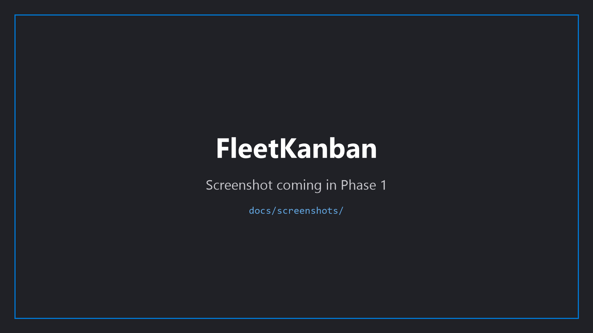

# FleetKanban

[English](./README.md) | [日本語](./README.ja.md) | [简体中文](./README.zh-CN.md) | **Русский** | [Español](./README.es.md) | [Deutsch](./README.de.md) | [Português (BR)](./README.pt-BR.md)

<!-- TODO(phase1): replace with docs/screenshots/hero-kanban-board.png -->

  

  <b>Автономный мультиагентный исполнитель задач для вашего десктопа на Windows 11.</b> 
  Опишите желаемый результат. FleetKanban планирует, запускает задачи параллельно в изолированных git worktree
  и передаёт каждый diff вам — финальное решение остаётся за вами.

  
  
  
  

---

## Зачем FleetKanban

- **Plan → параллельное выполнение → вы утверждаете.** AI планирует реализацию, запускает до 12 задач параллельно в изолированных git worktree и оставляет финальный выбор **Keep / Merge / Discard** за вами.
- **Никогда не пишет в ваш remote.** Никаких `git push`, создания PR, авто-merge — запись в remote происходит только тогда, когда вы делаете это сами.
- **Настоящее приложение Windows 11.** Mica / Acrylic, Jump List, toast-уведомления, прогресс в панели задач — собрано на Flutter desktop, а не на Electron.

## Download

- Последняя сборка: [GitHub Releases](https://github.com/FleetKanban/fleetkanban/releases/latest) → `com.fleetkanban.FleetKanban-win-Setup.exe`
- Вам потребуется: **Windows 11 64-бит** · **подписка GitHub Copilot** · **Git for Windows**
- После установки приложение **обновляется в один клик** через InfoBar внутри приложения.

> **Early Preview.** FleetKanban находится в разработке Phase 1. До появления первого тегированного релиза смотрите [CONTRIBUTING.md](./CONTRIBUTING.md), чтобы собрать из исходников уже сегодня.

> **SmartScreen.** Phase 1 поставляется без подписи, поэтому Windows SmartScreen при первом запуске покажет «Система Windows защитила ваш компьютер». Нажмите «Подробнее» → «Выполнить в любом случае», чтобы продолжить. EV / Azure Trusted Signing запланированы на Phase 2.

## Как это работает

1. **Опишите задачу на естественном языке**
   Например: *«Обновить боковую панель, чтобы она поддерживала тёмную тему»*.
   <!-- TODO(phase1): replace with docs/screenshots/how-1-new-task.png -->
   

2. **AI планирует и разбивает задачу на DAG из Subtask**
   Этап Plan формирует план выполнения и разбивает работу на параллельные / последовательные subtask, визуализированные компоновкой Sugiyama.
   <!-- TODO(phase1): replace with docs/screenshots/how-2-subtask-dag.png -->
   

3. **Параллельное выполнение в изолированных git worktree**
   По умолчанию — 4 задачи параллельно, до 12. Каждая subtask выполняется в собственном git worktree — ваша ветка `main` остаётся чистой, задачи никогда не пересекаются.
   <!-- TODO(phase1): replace with docs/screenshots/how-3-parallel-running.png -->
   

4. **AI Review → Human Review**
   После того как AI выполнит самопроверку, вы читаете diff и выбираете **Keep / Merge / Discard**. Ничего не сливается автоматически.
   <!-- TODO(phase1): replace with docs/screenshots/how-4-diff-review.png -->
   

## Чем FleetKanban отличается

FleetKanban сознательно идёт иным путём, чем Claude Code, Cursor и GitHub Copilot Workspace:

- **Нативный десктоп Windows 11.** Не веб-IDE и не форк VS Code. Fluent Design, Mica, Jump List и прогресс в панели задач — всё это первоклассные возможности.
- **Много задач параллельно, полностью изолированных.** Запускайте несколько независимых задач против одного и того же репозитория одновременно — ветки и рабочие деревья никогда не пересекаются.
- **Полностью локально.** Состояние задач, логи и база знаний репозитория лежат в SQLite в `%APPDATA%`. Ваш код не отправляется ни в какой облачный сервис (трафик Copilot API такой же, как у любого другого Copilot-клиента).
- **Проектируемая среда выполнения агента (IHR).** Intelligent Harness Runtime управляет переходами между стадиями Plan / Code / Review по YAML-charter’у, который вы можете на лету править прямо из UI. Поведение проектируется, а не скрывается.
- **Property-граф + FTS5 + эмбеддинги.** FleetKanban индексирует ваш репозиторий как Context / Graph Memory и внедряет в каждую сессию агента только релевантный контекст — в три слоя (Passive / Reactive / Active), слитые через RRF.

## Требования

- Windows 11 64-бит
- Подписка GitHub Copilot (Individual, Business или Enterprise)
- Git for Windows 2.45+
- PowerShell 7 (приложение при первом запуске предлагает установить в один клик, если его нет)

Полный список требований и флаги пропуска для CI описаны в [CONTRIBUTING.md](./CONTRIBUTING.md#environment-setup).

## FAQ

- **Мой код уходит в облако?** Состояние задач, логи и индекс знаний хранятся локально в SQLite. Когда работает агент, Copilot SDK обращается к GitHub Copilot API так же, как любой другой Copilot-клиент, — больше ничего вашу машину не покидает.
- **Приложение само будет пушить в мой remote?** Нет. `git push`, создание PR и авто-merge попросту не реализованы. Push и открытие PR — это то, что вы делаете явно, через Git CLI, GitHub Desktop или вашу IDE.
- **Работает ли оно на macOS / Linux?** Нет. FleetKanban работает только на Windows 11 64-бит — окончательно.

## Документация и ссылки

- [docs/architecture.md](./docs/architecture.md) — внутренняя архитектура
- [docs/roadmap.md](./docs/roadmap.md) — планы Phase 2 / 3
- [CHANGELOG.md](./CHANGELOG.md) — история версий
- [CONTRIBUTING.md](./CONTRIBUTING.md) — процесс сборки и разработки (для разработчиков, которые хотят попробовать из исходников)
- [CODE_OF_CONDUCT.md](./CODE_OF_CONDUCT.md)

## Безопасность

Если вы нашли уязвимость, **не открывайте публичный Issue.** Следуйте процедуре из [SECURITY.md](./SECURITY.md) и сообщайте непублично через GitHub Security Advisories (вкладка Security репозитория).

## Лицензия

MIT — см. [LICENSE](./LICENSE).
