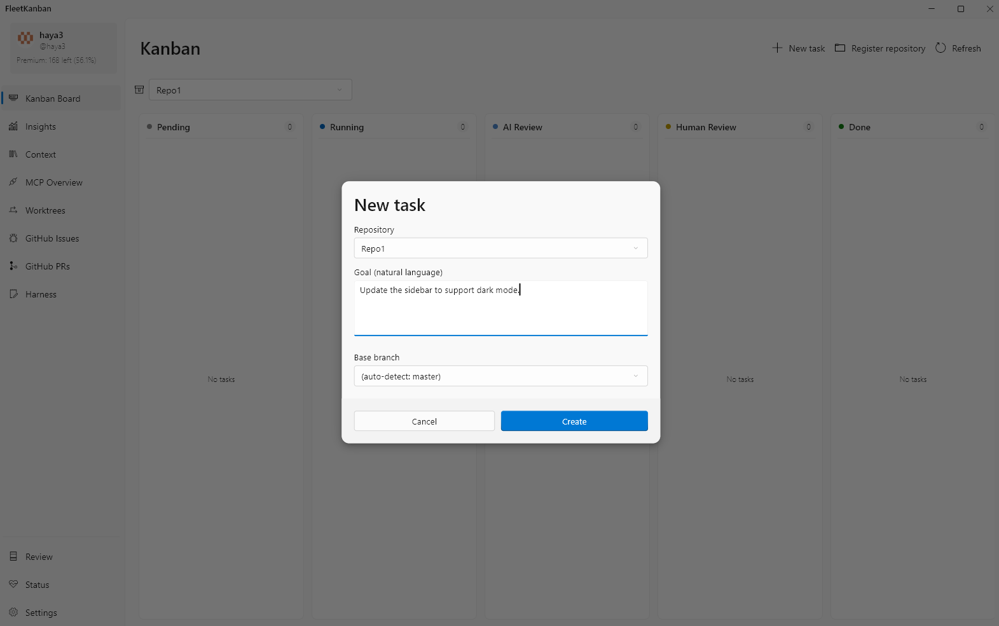
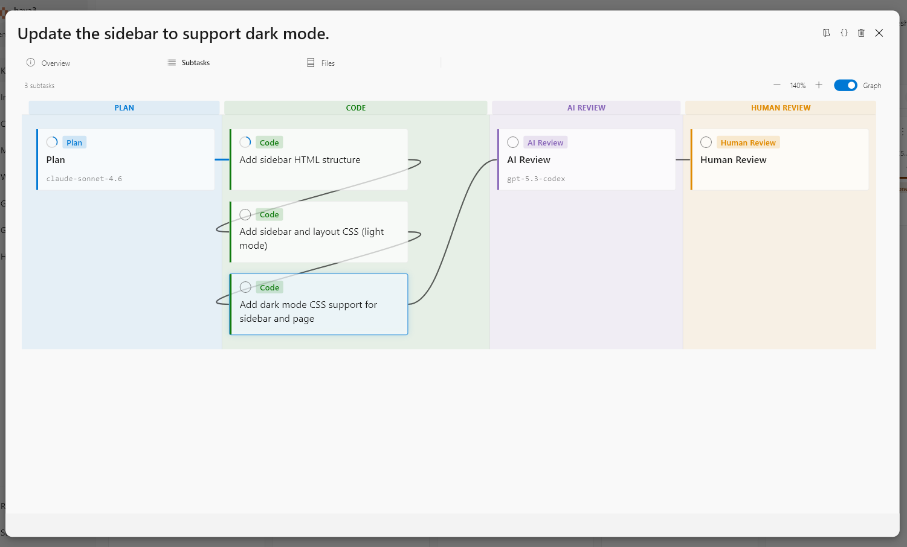
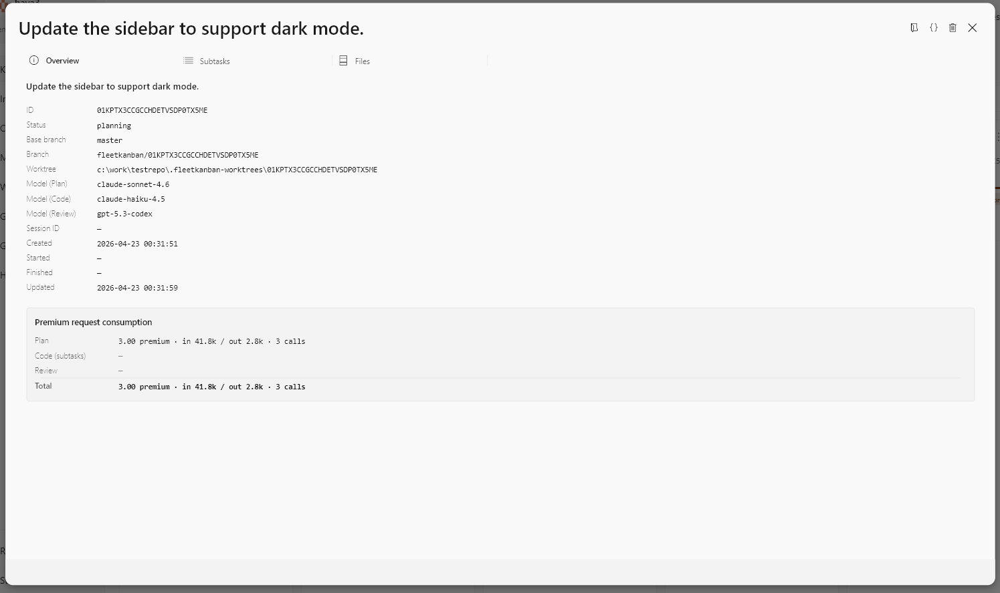
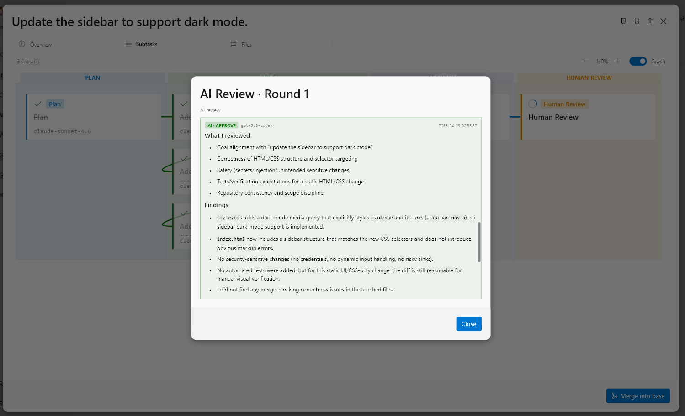

# FleetKanban

[English](./README.md) | [日本語](./README.ja.md) | **简体中文** | [Русский](./README.ru.md) | [Español](./README.es.md) | [Deutsch](./README.de.md) | [Português (BR)](./README.pt-BR.md)

<!-- TODO(phase1): replace with docs/screenshots/hero-kanban-board.png -->
<p align="center">
  
</p>

<p align="center">
  <b>面向 Windows 11 桌面的自主多智能体任务执行器。</b><br>
  描述你想要的结果，它会自动规划、在隔离的 git worktree 上并行执行任务，
  并把每一份 diff 交回给你做最终决定。
</p>

<p align="center">
  <a href="#download"></a>
  
  
  
</p>

---

## 为什么选择 FleetKanban

- **规划 → 并行执行 → 由你审批。** AI 负责制定实现方案，在隔离的 git worktree 上并行运行最多 12 个任务，最终的 **Keep / Merge / Discard** 决定权留给你。
- **从不写入你的远程仓库。** 没有 `git push`、不会创建 PR、不会自动合并 — 只有你亲自操作时才会发生远程写入。
- **零遥测，面向企业环境安全。** 没有使用情况分析、没有崩溃报告、没有回传服务器。唯一的外部流量是你的智能体发起的 Copilot API 调用 — 可以放心地部署在企业环境边界之内。
- **真正的 Windows 11 原生应用。** Mica / Acrylic、Jump List、Toast 通知、任务栏进度 — 使用 Flutter 桌面构建，而非 Electron。

## 下载

- 最新构建：[GitHub Releases](https://github.com/haya3/FleetKanban/releases/latest) → `com.fleetkanban.FleetKanban-win-Setup.exe`
- 运行条件：**Windows 11 64 位** · **GitHub Copilot 订阅** · **Git for Windows**
- 安装后，应用可通过应用内 InfoBar **一键自更新**。

> **Early Preview（从源码构建）。** FleetKanban 目前处于 Phase 1 开发阶段。在首个 tag 版本发布之前，请[从源码构建](#从源码构建early-preview)——只需一个 PowerShell 脚本即可完成。

> **SmartScreen。** Phase 1 发布时为未签名版本，因此 Windows SmartScreen 在首次启动时会显示“Windows 已保护你的电脑”。点击“更多信息”→“仍要运行”即可继续。EV / Azure Trusted Signing 计划在 Phase 2 引入。

## 从源码构建（Early Preview）

在首个 tag 版本发布之前，一个 PowerShell 脚本即可通过 winget 安装完整的工具链（Go、Flutter、VS 2022 Build Tools、.NET SDK、Task、Velopack `vpk`），并产出可运行的安装包：

```powershell
git clone https://github.com/haya3/FleetKanban.git
cd FleetKanban\repo
powershell -NoProfile -ExecutionPolicy Bypass -File .\scripts\build-from-source.ps1
# → build\release\com.fleetkanban.FleetKanban-win-Setup.exe
```

运行生成的 `Setup.exe` 一次即可完成安装。该脚本是幂等的——重复执行只会安装缺失的部分。

### 更新自构建安装

已安装的应用会通过 Velopack feed 标记（`update-feed.txt`）轮询你本地的 `build\release\` 目录，因此更新只需重新构建即可——无需单独的重装步骤。可以选择：

- **在应用内（一键完成）。** 打开 **Settings → Source updates (self-built install) → Pull & rebuild from source**。该按钮会执行 `git pull --ff-only` + 构建脚本，实时跟踪构建日志，新版本就绪时应用内的 **Update InfoBar** 会自动出现。点击即可替换二进制并重启。
- **在终端中。** `git pull; .\scripts\build-from-source.ps1 -SkipPrereqs`，然后等待同样的 InfoBar。

两条路径都会把新包写入 `build\release\`；正在运行的应用会在不重装的前提下自动拾取。若希望已安装的应用把它视为更新版本，请在重新构建前同步提升 `ui/pubspec.yaml`、`ui/lib/app/version.dart` 与 `sidecar/internal/branding/branding.go` 中的 `appVersion`（由 `check-versions.ps1` 强制校验）。完整构建细节：[CONTRIBUTING.md](./CONTRIBUTING.md#environment-setup)。

## 工作原理

1. **用自然语言描述你的任务**
   例如：*“更新侧边栏以支持暗色模式。”*
   

2. **AI 进行规划，并将其拆分为 Subtask DAG**
   Plan 阶段生成执行计划，将工作拆解为并行 / 串行的 Subtask，并以 Sugiyama 布局可视化展示。
   

3. **在隔离的 git worktree 上并行执行**
   默认 4 个任务并行，最多可达 12 个。每个 Subtask 都在各自的 git worktree 中运行 — 你的 `main` 分支保持整洁，任务之间永不冲突。
   

4. **AI Review → Human Review**
   AI 自我审查之后，由你阅读 diff 并选择 **Keep / Merge / Discard**。没有任何内容会被自动合并。
   

## FleetKanban 的与众不同

FleetKanban 有意走出与 Claude Code、Cursor 以及 GitHub Copilot Workspace 不同的路线：

- **Windows 11 原生桌面应用。** 既不是 Web IDE，也不是 VS Code 的 fork。Fluent Design、Mica、Jump List 以及任务栏进度均为第一级支持。
- **多任务并行，完全隔离。** 可以同时对同一个仓库运行多个独立任务 — 分支与工作树彼此互不干扰。
- **完全本地化。** 任务状态、日志与仓库知识库都存储在 `%APPDATA%` 下的 SQLite 中。你的代码不会被发送到云服务（Copilot API 的流量与其他任何 Copilot 客户端一致）。
- **可设计的智能体运行时（IHR）。** Intelligent Harness Runtime 依据一份你可以从 UI 热编辑的 YAML charter 驱动 Plan / Code / Review 的阶段转换。行为是被设计出来的，而非藏在暗处。
- **属性图 + FTS5 + 向量嵌入。** FleetKanban 将你的仓库索引为 Context / Graph Memory，并通过 RRF 融合后的三段式（Passive / Reactive / Active）机制，只把相关上下文注入每次智能体会话。

## 运行要求

- Windows 11 64 位
- GitHub Copilot 订阅（Individual、Business 或 Enterprise）
- Git for Windows 2.45+
- PowerShell 7（若缺失，应用会在首次启动时提供一键安装）

完整的先决条件与 CI skip flags 见 [CONTRIBUTING.md](./CONTRIBUTING.md#environment-setup)。

## FAQ

- **我的代码会被发送到云端吗？** 任务状态、日志与知识索引全部本地存储在 SQLite 中。智能体运行时，Copilot SDK 与 GitHub Copilot API 的通信方式与其他任何 Copilot 客户端完全相同 — 除此之外没有任何内容离开你的机器。
- **FleetKanban 会收集遥测吗？** 不会。没有使用情况分析、没有崩溃报告，也没有回传服务器的端点。应用对外的流量仅限于智能体在执行任务期间发起的 Copilot API 调用（与其他任何 Copilot 客户端一致），以及应用内升级提示针对 GitHub Releases 执行的版本检查。这使得 FleetKanban 可以安全地部署到企业环境中 — 搭配 Copilot Business 或 Enterprise 订阅使用，你的代码便能始终留在企业环境边界之内。
- **它会自行推送到我的远程吗？** 不会。`git push`、PR 创建与自动合并根本没有实现。推送与开 PR 是你使用 Git CLI、GitHub Desktop 或你的 IDE 显式完成的操作。
- **支持 macOS / Linux 吗？** 不支持。FleetKanban 永久只支持 Windows 11 64 位。

## 文档与链接

- [docs/architecture.md](./docs/architecture.md) — 内部架构
- [docs/roadmap.md](./docs/roadmap.md) — Phase 2 / 3 规划
- [CHANGELOG.md](./CHANGELOG.md) — 版本历史
- [CONTRIBUTING.md](./CONTRIBUTING.md) — 构建与开发流程（面向想要从源码尝试的开发者）
- [CODE_OF_CONDUCT.md](./CODE_OF_CONDUCT.md)

## 安全

若发现漏洞，**请勿创建公开 Issue。** 请遵循 [SECURITY.md](./SECURITY.md) 的流程，通过 GitHub Security Advisories（仓库的 Security 标签页）以非公开方式报告。

## 许可证

MIT — 详见 [LICENSE](./LICENSE)。
